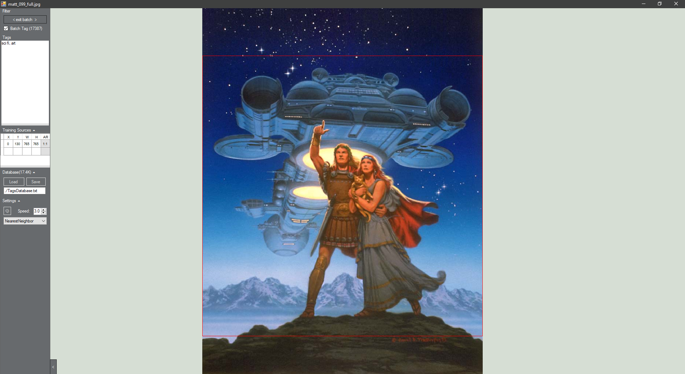

# Image-Tagger
A super simple image viewer with the ability to tag and batch tag images, search by tags, and define source regions for AI training purposes

Controls:
* Left/Right to scroll images, or click on the edges
* Space to enter/exit gallery slideshow mode (Escape also exits)
* Mouse click to pan, mouse wheel to zoom
* Drag in more than one image to begin a batch. Dragging in more images adds to the batch.
* Alt disables maintaining aspect ratio when resizing the training area by the corners
* L & R to show/hide the left & right panels

Implemented:
* Tagging
* Searching images by tags
* Saving/Loading a text file of image locations, image tags, and image training regions
* Definable regions for AI training
* Gallery functionality
* Full-screen slideshow with speed setting
* Interpolation options
* Somewhat efficient handling of large volumes of images (dragging in tens of thousands may take a minute)
* Clickable tags or text input, switch between modes by clicking on Filter<> or Tags<>
* Drag & Drop to tag names to quickly tag images or groups of images (e.g. in split screen view with explorer). On the right panel shown by pressing R

Not Implemented:
* Removing images from the current batch
* Removing images from the database (can be done manually with a text editor)
* Negative search terms
* WebP support, GIF playback

It occasionally freezes when importing large batches of images, which I'm looking into. It's best to save beforehand.

Filtering on tags with tens of thousands of images can be slow, however putting less common tags first can solve this

Using [an icon from flaticon](https://www.flaticon.com/free-icon/computer_8891318)
