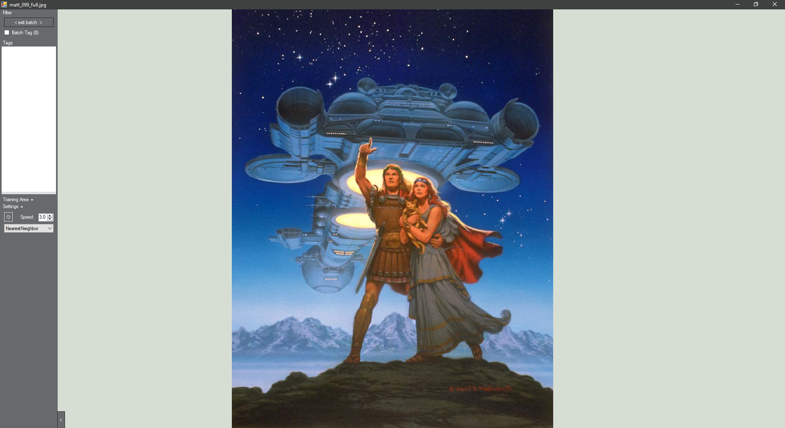

# Image-Tagger
A super simple image viewer with the ability to tag images on a desktop pc, search by tags, and mark clipping regions for AI training purposes

Controls:
* Left/Right to scroll images, or click on the edges
* Space to enter/exit gallery slideshow mode (Escape also exits)
* Mouse click to pan, mouse wheel to zoom
* Drag in more than one image to begin a batch. Dragging in more images adds to the batch.

Implemented:
* Gallery functionality
* Full-screen slideshow with speed setting
* Interpolation options
* Somewhat efficient handling of large volumes of images (dragging in tens of thousands may take a minute)

Not Implemented:
* Tagging
* Searching Tags
* AI Data Clipping Regions
* Saving/Loading the database of image locations, image tags, and image training regions
* Removing images from the current batch
* WebP support, GIF playback
