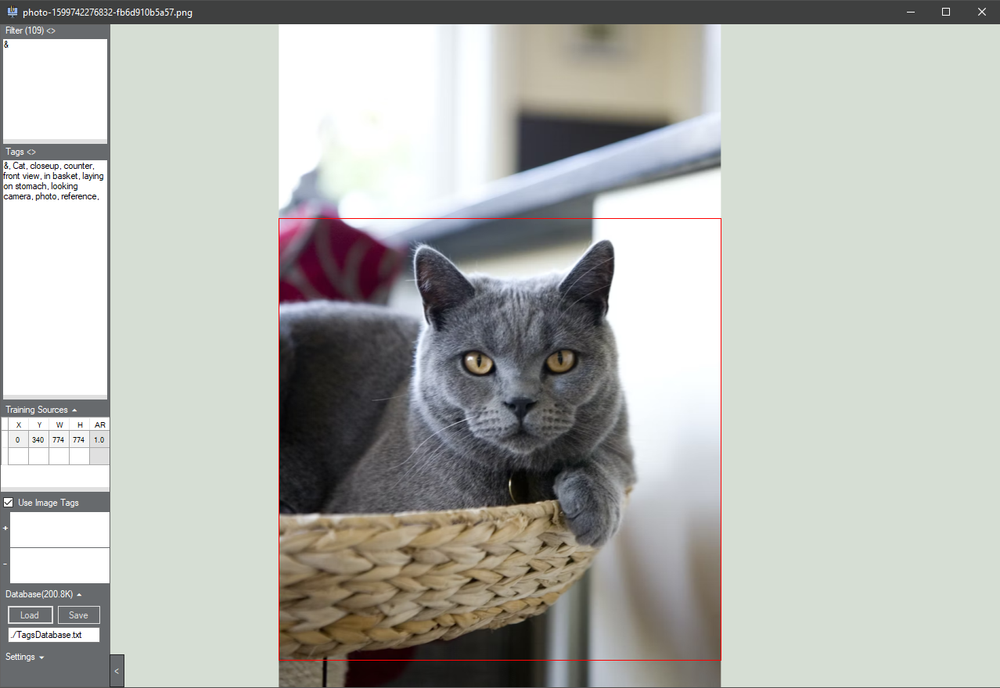

# Image-Tagger
An uncluttered image viewer with the ability to tag and batch tag images, search by tags, and define source regions for AI training purposes

Controls:
* Left/Right to scroll images, or click on the edges
* Space to enter/exit gallery slideshow mode (Escape also exits)
* Mouse click to pan, mouse wheel to zoom
* Drag in more than one image to begin a batch. Dragging in more images adds to the batch
* Ctrl B to enter or exit batch mode. Can convert current search results into a batch
* Alt disables snapping to pre-programmed aspect ratios when resizing the selected training area
* F to automatically select as much of the image as possible for one of the valid training aspect ratios (useful since mouse snapping is a bit clunky)
* L & R to show/hide the left & right panels
* Ctrl+V to paste the current clipboard text to the tags list, without having to select the text box

Implemented:
* Tagging
* Searching images by tags
* Clickable tags or text inputs, switch between by clicking on Filter<> or Tags<>
* Drag & Drop images (dragging in tens of thousands may take a minute)
* Drag & Drop onto tag names for fast tagging. Located on the right panel shown by pressing R
* Gallery functionality
* Full-screen slideshow with speed setting
* Interpolation options
* Definable regions for AI training
* Saving/Loading a database text file of image locations, image tags, and image training regions

Not Implemented:
* Removing images from the current batch
* Removing images from the database (can be done manually with a text editor)
* Negative search terms
* WebP support, GIF playback

The training area selections currently snap to match the following aspect ratios and their inversions: 512:512, 512:576, 512:640, 512:704, 512:768, 512:832

To rename a tag, search for all images with the tag and enter batch mode (Ctrl B), then use batch tagging to rename the tag for all images which use it.

It occasionally freezes when dragging in large batches of images. It's best to save beforehand.

Using [an icon from flaticon](https://www.flaticon.com/free-icon/computer_8891318)
